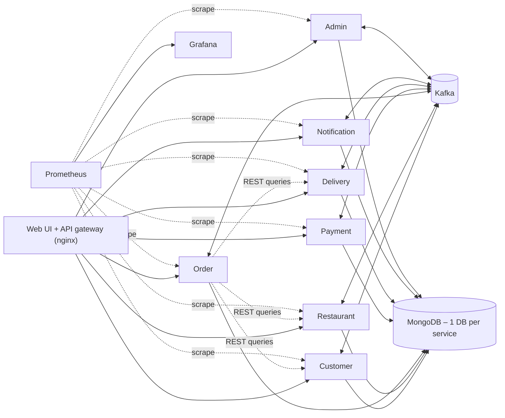

# Namibia Eats – Distributed Food Delivery Platform

**DSA612S – Distributed Systems and Applications, Assignment 2 (2026)**

An event-driven food delivery platform for local SMEs (restaurants and delivery drivers).
It is built as **7 Ballerina microservices** that communicate through **Kafka**, persist
data in **MongoDB** (one database per service), and are orchestrated with **Docker Compose**.
The platform also includes a web UI, live driver tracking on a map, A\* route optimisation,
surge pricing, and Prometheus/Grafana monitoring.

| | |
|---|---|
| Backend | Ballerina Swan Lake 2201.13.6 (`ballerina/http`, `ballerinax/kafka`, `ballerinax/mongodb`) |
| Messaging | Apache Kafka 3.9 (KRaft) – 17 managed topics, keyed partitions, DLQ |
| Persistence | MongoDB 7 – database-per-service, `$jsonSchema` validation, unique-index idempotency |
| Infrastructure | Docker multi-stage images, Docker Compose, isolated networks, health checks |
| Extras | Web UI (Leaflet map), driver location simulation, A\* routing, surge pricing, Prometheus + Grafana |

---

## 1. Quick start

**Prerequisites:** Docker Desktop (WSL2 backend on Windows) with at least **4 GB of memory**
available to Docker. No local Ballerina installation is needed, because the images compile
the services themselves.

```bash
git clone https://github.com/fransrichy/Distributive-System-2026-Assignment-Two.git
cd Distributive-System-2026-Assignment-Two

# whole platform + Prometheus/Grafana (first build downloads images: ~5-10 min)
docker compose --profile monitoring up -d --build

# watch everything become healthy
docker compose ps
```

| What | URL |
|------|-----|
| **Web UI** (customer / restaurant / driver / admin) | http://localhost:8080 |
| API gateway | `http://localhost:8080/api/<service>/…` – e.g. http://localhost:8080/api/restaurant-service/restaurants |
| Grafana dashboard (admin / admin) | http://localhost:3000 |
| Prometheus | http://localhost:9090 |
| Kafka UI (`--profile tools`) | http://localhost:8090 |
| Kafka (host clients) | `localhost:9094` |
| MongoDB (Compass) | `mongodb://localhost:27017` |

Run the scripted end-to-end demo (happy path, declined card, cancellation + refund):

```powershell
powershell -ExecutionPolicy Bypass -File scripts\demo.ps1     # Windows
```
```bash
./scripts/demo.sh                                               # Linux / macOS (needs curl + jq)
```

Demo login data is seeded automatically:

* Customers: `demo@fooddelivery.na`, `ndapewa@fooddelivery.na` and `johan@fooddelivery.na`, all with password `password123`.
* Restaurants: `R-1001` … `R-1005`. `R-1005` is closed on Sundays, which demonstrates opening hours.
* Drivers: `D-2001` … `D-2005`.

> **Low on RAM?** Leave out `--profile monitoring`, which saves about 500 MB. Then stop
> other applications, or give WSL more memory with `%UserProfile%\.wslconfig` → `[wsl2] memory=4GB`.

Stop everything with `docker compose --profile monitoring down`. Add `-v` to also wipe the
data.

---

## 2. Architecture



The **order saga**, with the Order service as orchestrator of the state machine:

```
POST /orders ─► Order: CREATED ──orders.created──► Payment ──payments.completed──► Order: CONFIRMED
                                                        └─payments.failed────────► Order: CANCELLED
Order ──orders.confirmed──► Restaurant (reserve stock, kitchen ticket) ──restaurant.order-preparing──► PREPARING
                         └► Delivery  (A* dispatch of the fastest driver) ──delivery.assigned
Restaurant ──restaurant.order-ready──► Order: READY  +  Delivery (food ready)
Delivery ──delivery.picked-up──► Order: OUT_FOR_DELIVERY ──delivery.completed──► Order: DELIVERED
Every event ──► Notification (email/SMS/push)   ·   Every event ──► Admin (analytics)
```

📄 More detail: **[Architecture](docs/architecture.md)** (diagrams, state machine,
compensations, persistence) · **[Kafka topics](docs/events.md)** ·
**[REST API](docs/api.md)**.

### Services

| Service | Port | Database | Highlights |
|---------|------|----------|------------|
| customer-service | 8081 | `customer_db` | accounts with bcrypt passwords, addresses (one default), notification preferences, order history built from events |
| restaurant-service | 8082 | `restaurant_db` | menus, **atomic real-time inventory**, overnight-aware opening hours, kitchen workflow (manual or simulated) |
| order-service | 8083 | `order_db` | **order state machine** with optimistic locking, saga orchestration, **surge pricing**, circuit breakers |
| payment-service | 8084 | `payment_db` | simulated gateway (card / mobile money / cash), idempotent charge, refund & void compensation |
| delivery-service | 8085 | `delivery_db` | **ETA-based dispatch**, **A\* route optimisation**, **live driver location simulation** |
| notification-service | 8086 | `notification_db` | email / SMS / push per customer preferences, de-duplicated by event |
| admin-service | 8087 | `admin_db` | restaurant statistics, delivery performance, KPIs, fleet map, system health, DLQ |

### Distributed-systems patterns used

| Pattern | Where |
|---------|-------|
| Event-driven choreography plus a saga orchestrator | Order service state machine, compensations on failure |
| Database per service, CQRS read models | customer `order_history`, admin `order_facts` |
| Idempotent consumers, at-least-once delivery | manual offset commits, unique indexes, `processed_events` |
| Idempotent producer, keyed partitions | `acks=all`, `enable.idempotence`, key = `orderId` / `driverId` |
| Retry, then dead-letter queue | 3 attempts with back-off → `events.dlq` |
| Optimistic concurrency control | `orders.version` compare-and-set, status-guarded updates everywhere |
| Circuit breaker, retries, timeouts | Ballerina HTTP clients in the Order service |
| Graceful degradation | surge pricing falls back to ×1.0 when the Delivery service is down |
| API gateway | nginx with Docker DNS (works with scaled replicas) |
| Health checks, observability | `/health` on every service, Docker `HEALTHCHECK`, Prometheus metrics, Grafana |
| Horizontal scaling | `docker compose up -d --scale payment-service=3` (6 partitions) |

---

## 3. Bonus features (Creativity & Extensions)

| Extension | Implementation |
|-----------|----------------|
| **Driver location simulation** | The Delivery service moves every active driver along their route once per tick and publishes `delivery.location-updated` (keyed by driver). The UI shows the driver moving on an OpenStreetMap/Leaflet overlay, with ETA. |
| **Route optimisation** | A\* search over a Windhoek road-network graph (arterial 60 km/h, local roads 35 km/h). It minimises travel time, and the CBD congests at peak times. Every free driver is routed to the restaurant and the fastest ETA wins. `GET /routes/plan`, `GET /routes/network`. |
| **Surge pricing** | Delivery fee = (N$15 + N$4/km) × surge. The surge depends on demand per available driver, fleet utilisation and lunch/dinner peaks, capped at ×2.5. It is shown live in the UI header and order quote. |
| **Complete UI** | `http://localhost:8080` has four role views. **Customer**: order and track live. **Restaurant**: kitchen board and inventory. **Driver**: online/offline, pickup and deliver, map. **Admin**: KPIs, statistics, fleet map with road network, health, Kafka topic counters, DLQ. |
| **Observability** | `ballerinax/prometheus` exposes HTTP metrics plus custom business metrics (`fd_orders_created_total`, `fd_order_transitions_total`, `fd_events_published/consumed_total`, `fd_surge_multiplier`, `fd_drivers`, …). A pre-provisioned Grafana dashboard shows them. |

---

## 4. Testing

**43 unit tests** cover the pure domain logic of every service: the state machine,
surge pricing, opening hours, payment rules, A\* routing and geometry, notification
routing, and report maths.

```bash
cd services/order-service && bal test        # repeat for each service
```

End-to-end: `scripts/demo.ps1` / `scripts/demo.sh` place real orders through the gateway
and assert that the full saga runs, including the failure and compensation paths.

Useful manual checks:

```bash
docker compose logs -f order-service payment-service          # watch the saga
docker exec kafka /opt/kafka/bin/kafka-consumer-groups.sh --bootstrap-server localhost:9092 --describe --all-groups
docker compose up -d --scale payment-service=3                 # consumer-group rebalancing
docker compose stop delivery-service                           # surge degrades gracefully, orders queue
```

---

## 5. Project structure

```
├── docker-compose.yml          # full orchestration (profiles: monitoring, tools)
├── services/
│   ├── <name>-service/
│   │   ├── Ballerina.toml, Config.toml, Dockerfile
│   │   ├── config.bal          # env-driven configuration + subscribed topics
│   │   ├── api.bal             # REST resources
│   │   ├── handlers.bal        # Kafka event handlers
│   │   ├── events.bal          # shared: topic catalogue, envelope, producer, consumer + DLQ
│   │   ├── platform.bal        # shared: HTTP listener, Mongo client, /health
│   │   ├── common.bal          # shared: config/time/id helpers, metrics
│   │   └── modules/domain/     # pure business logic + unit tests
├── infra/
│   ├── kafka/create-topics.sh  # topic management (partitions, retention)
│   ├── mongo/init-mongo.js     # schemas ($jsonSchema) + indexes
│   ├── prometheus/, grafana/   # monitoring configuration + dashboard
├── ui/                         # nginx gateway + single-page web app
├── scripts/demo.ps1, demo.sh   # end-to-end demo
└── docs/                       # architecture, events, API reference
```

## 6. Configuration

Each service reads environment variables, which `docker-compose.yml` sets:

| Variable | Default | Purpose |
|----------|---------|---------|
| `KAFKA_BOOTSTRAP_SERVERS` | `localhost:9094` | Kafka brokers |
| `MONGO_URI` / `MONGO_DATABASE` | `mongodb://localhost:27017` / per service | MongoDB |
| `AUTO_KITCHEN`, `AUTO_START_SECONDS`, `AUTO_PREP_SECONDS` | `true`, 5, 15 | simulated kitchen (set `false` to drive it from the UI) |
| `SIMULATION_ENABLED`, `AUTO_DRIVE`, `DRIVER_SPEED_KMH`, `SIM_SPEED_FACTOR` | `true`, `true`, 40, 8 | driver simulation |
| `PAYMENT_LATENCY_MS`, `PAYMENT_FAILURE_RATE` | 1200, 0.0 | payment gateway simulation |
| `TZ_OFFSET_HOURS` | 2 | Africa/Windhoek |
| `ON_TIME_TARGET_MINUTES` | 45 | delivery promise for the on-time KPI |

## 7. Evaluation criteria mapping

| Criterion | Weight | Evidence |
|-----------|-------:|----------|
| Kafka setup & topic management | 15% | `infra/kafka/create-topics.sh` (17 topics, partitions, retention, auto-create off), `events.bal` (idempotent keyed producer, consumer groups, manual commits, retries, DLQ), [docs/events.md](docs/events.md) |
| Database setup & schema design | 10% | database-per-service, `infra/mongo/init-mongo.js` (validators + unique indexes), embedded vs referenced modelling, CQRS read models ([architecture](docs/architecture.md#persistence)) |
| Microservices implementation (Ballerina) | 50% | 7 services, state machine with optimistic locking, saga compensations, REST APIs with validation, 43 unit tests |
| Docker configuration & orchestration | 20% | multi-stage non-root images, health checks, dependency ordering, restart policies, memory limits, isolated networks, scaling, profiles |
| Documentation & presentation | 5% | this README, `docs/`, Mermaid diagrams, demo scripts |

## 8. Group members

| Name | Student number | Contribution |
|------|----------------|--------------|
|  |  |  |
