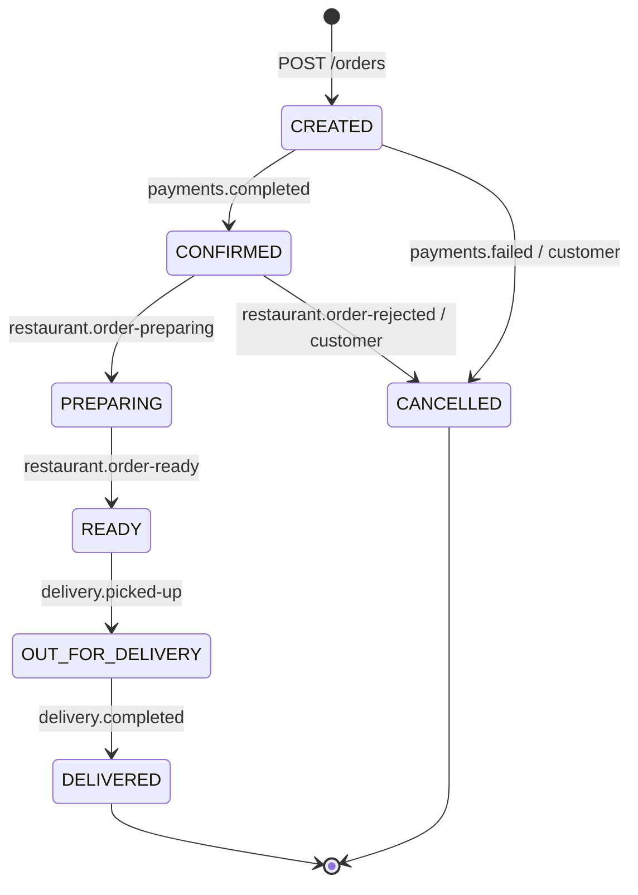
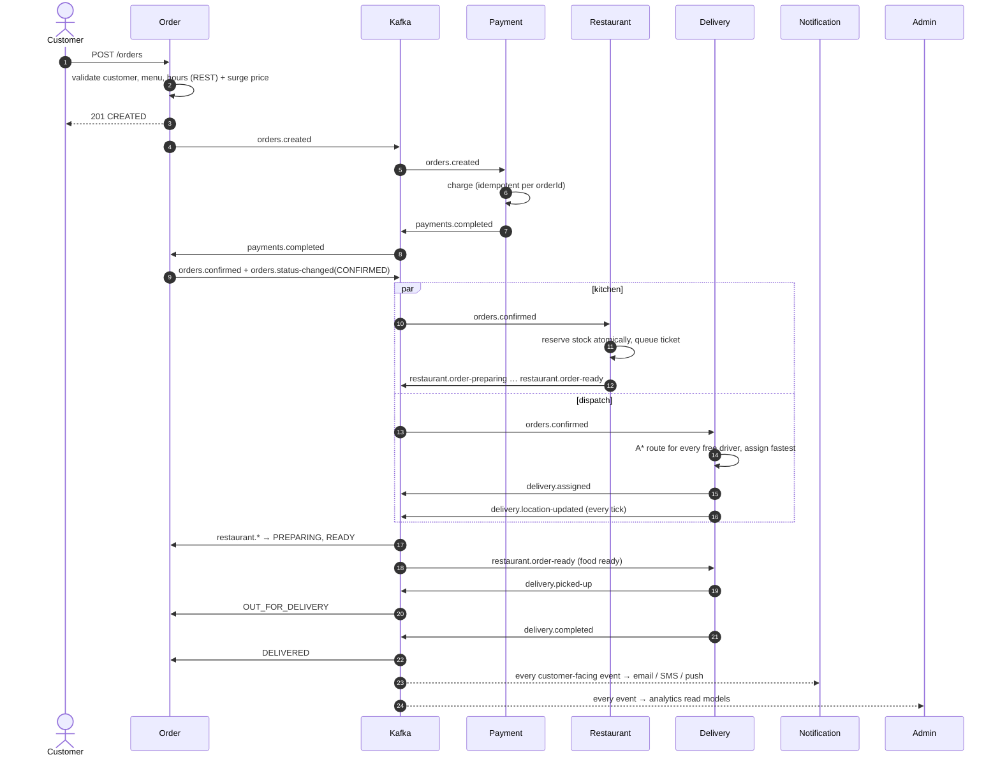

# Distributed Food Delivery Platform – Architecture

## Overview

The platform is built as **seven independent Ballerina microservices**. Each owns one
business capability and **its own MongoDB database**. Services never read each other's
databases. They collaborate through **Kafka events**, which drive the asynchronous order
lifecycle. They also make a few **synchronous REST queries**, used only for read-only
lookups such as menus and prices.

```mermaid
flowchart LR
    subgraph Edge["frontend network"]
        UI["Web UI + API gateway<br/>(nginx :8080)"]
    end

    subgraph Services["Ballerina microservices"]
        CS["Customer<br/>:8081"]
        RS["Restaurant<br/>:8082"]
        OS["Order<br/>:8083<br/><i>saga orchestrator</i>"]
        PS["Payment<br/>:8084"]
        DS["Delivery<br/>:8085"]
        NS["Notification<br/>:8086"]
        AS["Admin<br/>:8087"]
    end

    subgraph Backend["backend network"]
        K[("Kafka (KRaft)<br/>17 topics")]
        M[("MongoDB<br/>7 databases")]
        P["Prometheus"] --> G["Grafana"]
    end

    UI -->|/api/*-service| CS & RS & OS & PS & DS & NS & AS
    OS -. REST: customer, menu .-> CS & RS
    OS -. REST: driver supply .-> DS
    CS & RS & OS & PS & DS & NS & AS <-->|produce / consume| K
    CS & RS & OS & PS & DS & NS & AS --> M
    P -. scrape :9797 .-> Services
```

## Services

| # | Service | Responsibility | Database | Consumes | Produces |
|---|---------|----------------|----------|----------|----------|
| 1 | **Customer** | Accounts (bcrypt passwords), delivery addresses, notification preferences, order history read model | `customer_db` | `orders.status-changed` | `customers.registered` |
| 2 | **Restaurant** | Restaurants, opening hours (overnight-aware), digital menus, **real-time inventory**, kitchen queue | `restaurant_db` | `orders.confirmed`, `orders.cancelled` | `restaurant.order-preparing`, `restaurant.order-ready`, `restaurant.order-rejected` |
| 3 | **Order** | Central **order state machine** and saga coordinator, surge pricing | `order_db` | payments.\*, restaurant.\*, delivery.\* | `orders.created`, `orders.confirmed`, `orders.status-changed`, `orders.cancelled` |
| 4 | **Payment** | Simulated payment gateway, idempotent charging, refunds and voids | `payment_db` | `orders.created`, `orders.cancelled` | `payments.completed`, `payments.failed`, `payments.refunded` |
| 5 | **Delivery** | Drivers, **ETA-based dispatch**, **A\* route optimisation**, **live location simulation** | `delivery_db` | `orders.confirmed`, `restaurant.order-ready`, `orders.cancelled` | `delivery.assigned`, `delivery.picked-up`, `delivery.location-updated`, `delivery.completed` |
| 6 | **Notification** | Email / SMS / push alerts to customers, restaurants and drivers, honouring each customer's preferences | `notification_db` | customer, order, payment and delivery events | `notifications.sent` |
| 7 | **Admin** | Analytics read models, restaurant statistics, delivery performance, fleet view, system health, DLQ viewer | `admin_db` | *all topics* | – |

## Order lifecycle

The state machine lives in `services/order-service/modules/domain` and is pure code with no
I/O, so it is unit-tested in isolation. It has three properties that matter in a
distributed setting:

* **Idempotent:** a duplicate or stale event produces an empty transition plan and is
  ignored.
* **Out-of-order tolerant:** events arrive on different topics, so `delivery.picked-up` can
  be seen before `restaurant.order-ready`. Forward events advance along the happy path and
  record every intermediate step.
* **Concurrency safe:** updates use **optimistic locking** (`version` field
  compare-and-set), so a customer cancellation and a Kafka event that race on the same
  order cannot overwrite each other.

## Event flow (saga)

### Compensations (failure paths)

| Failure | What happens |
|---------|--------------|
| Card declined (`cardLast4 = 0000`) or wallet limit exceeded | `payments.failed` → order `CANCELLED` → customer gets SMS + push |
| Stock ran out between ordering and confirming | Restaurant rolls back the lines it already reserved → `restaurant.order-rejected` → order `CANCELLED` → `orders.cancelled` → Payment **refunds** |
| Customer cancels in `CREATED`/`CONFIRMED` | `orders.cancelled` → Payment refunds (or **voids**, if the cancellation overtook the charge) → Restaurant releases stock → Delivery releases the driver |
| Kafka unavailable while placing an order | The order is cancelled immediately and the API returns 503 – no orphan orders |
| A consumer cannot process an event | Retried 3× with back-off, then parked in `events.dlq` (visible in the Admin UI) – the partition is never blocked |
| Delivery service down while pricing | Circuit breaker opens, surge pricing degrades to the neutral multiplier |
| No free driver | Delivery stays `PENDING_ASSIGNMENT` and is retried every simulation tick |

## Kafka design

* **KRaft mode**, single broker, `auto.create.topics.enable=false`. All 17 topics are
  created explicitly by `infra/kafka/create-topics.sh` with explicit partition counts and
  retention.
* **Partition keys:** order-lifecycle events are keyed by `orderId` and telemetry by
  `driverId`. All events of one order therefore land in one partition, which preserves
  their order, while different orders are processed in parallel.
* **Producers:** `acks=all`, `enable.idempotence=true` and retries, so the broker never
  stores duplicates caused by producer retries.
* **Consumers:** one consumer group per service (e.g. `payment-service`), manual offset
  commits after processing (**at-least-once**), and idempotent handlers that use unique
  Mongo indexes and state checks, giving an **effectively-once** outcome.
* **Envelope:** every message shares the same JSON envelope:
  `{eventId, eventType, source, occurredAt, occurredAtMs, key, schemaVersion, data}`.
* **Scaling:** hot topics have 6 partitions, so a service can be scaled to 6 replicas, for
  example `docker compose up -d --scale payment-service=3`. Kafka rebalances the
  partitions across the group.

See [events.md](events.md) for the full topic catalogue.

## Persistence

Each service exclusively owns its database (**database-per-service**):

| Database | Collections | Notable modelling decisions |
|----------|-------------|-----------------------------|
| `customer_db` | `customers`, `order_history` | Addresses are embedded (always read with the customer); order history is a denormalised read model built from events |
| `restaurant_db` | `restaurants`, `menu_items`, `kitchen_tickets` | One document per dish, so stock can be decremented atomically with `{stock: {$gte: qty}}`; the schema forbids `stock < 0` |
| `order_db` | `orders` | Line items, address and status history are embedded (an order is one aggregate); prices are snapshotted at order time; `version` is used for optimistic locking |
| `payment_db` | `payments` | Unique index on `orderId` gives at most one charge per order; only the last 4 card digits are ever stored |
| `delivery_db` | `drivers`, `deliveries` | Each delivery stores its current optimised route, progress and live position; unique `orderId` |
| `notification_db` | `notifications`, `contacts` | Deterministic `notificationId = eventId-recipient-channel` with a unique index, so redelivered events never send an alert twice |
| `admin_db` | `order_facts`, `event_counters`, `processed_events`, `fleet_positions`, `dead_letters` | Analytics read model (CQRS); `processed_events` provides exactly-once effects |

`infra/mongo/init-mongo.js` creates every collection with a **`$jsonSchema` validator**
and the indexes needed by the access patterns.

## Containerisation

* Each service has a **multi-stage Dockerfile**. `ballerina/ballerina:2201.13.6` compiles
  the service, then a slim `eclipse-temurin:21-jre` image runs it as a **non-root** user
  with a Docker `HEALTHCHECK` and bounded JVM memory.
* `docker-compose.yml` orchestrates **Kafka, a topic-init job, MongoDB, 7 services, the
  nginx gateway/UI, and Prometheus + Grafana**. Startup ordering uses health checks
  (`service_healthy`, `service_completed_successfully`), with restart policies and
  per-container memory limits.
* **Network isolation:** Kafka and MongoDB sit only on the `backend` network, while the
  gateway sits only on `frontend`. Clients can therefore reach the services only through
  the gateway and can never reach the infrastructure.
